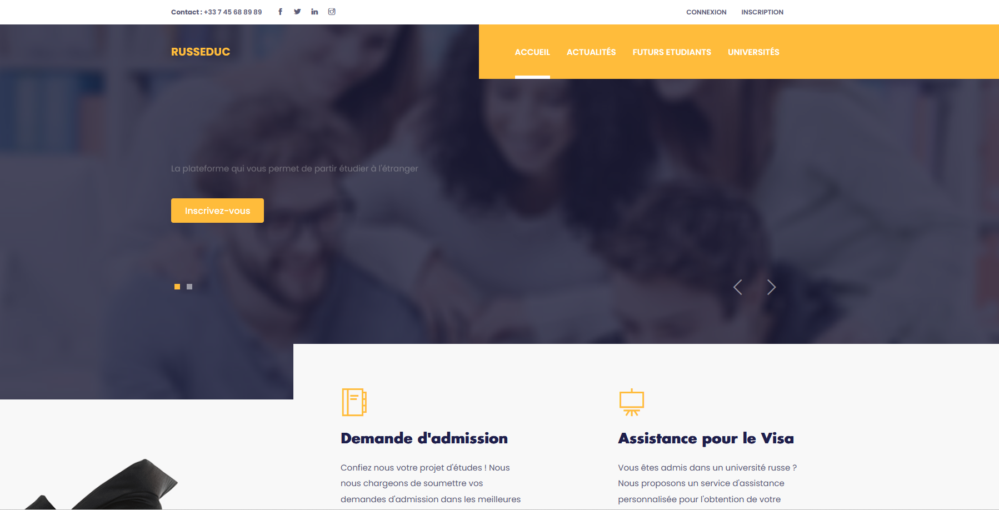
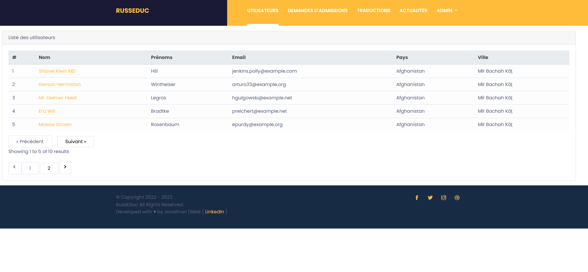
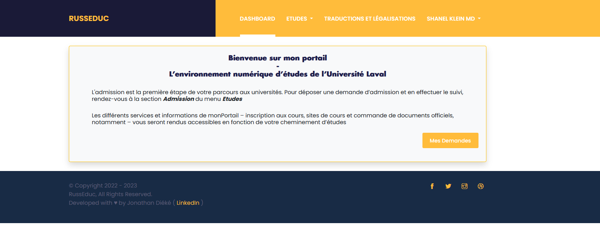

<h1 align="center">RUSSEDUC</h1>

 

 
 

## About RUSSEDUC

RUSSEDUC est une plateforme web construite avec Laravel 9 permettant principalement de collecter des candidatures d'étudiants étrangers pour des universités russes. 

Il est doté d'unsystème d'administration simple :

 

Et d'un espace utilisateur dédié aux candidats.

 

Vous pouvez le tester sur ce lien : <a href="#"> www.example.com </a> avec les rôles suivants : 
- USER : test@test.fr ||  password 
- ADMIN :  admin@admin.fr || password
