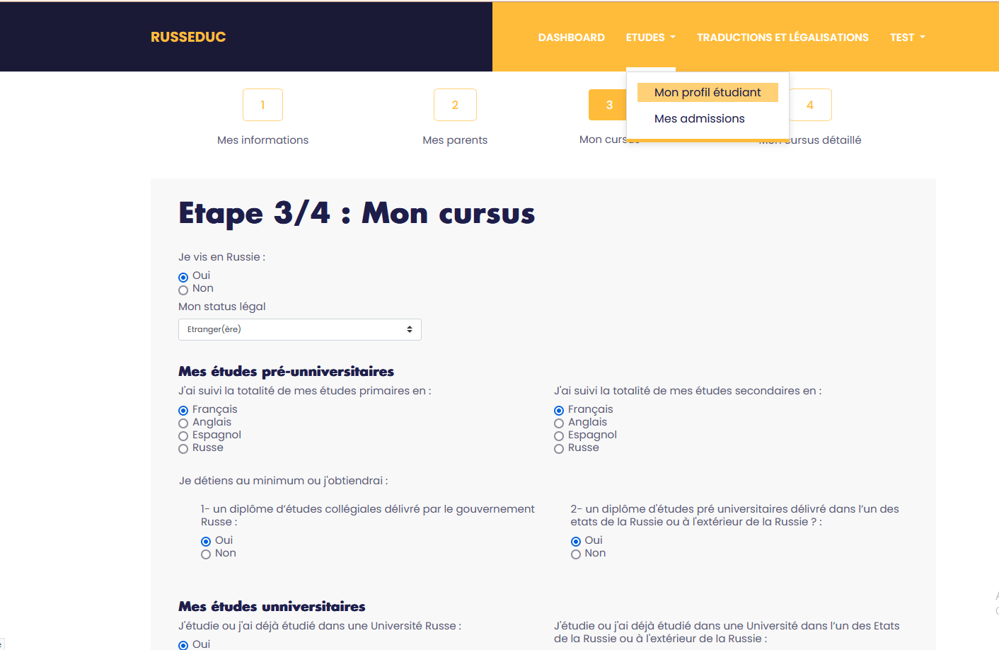
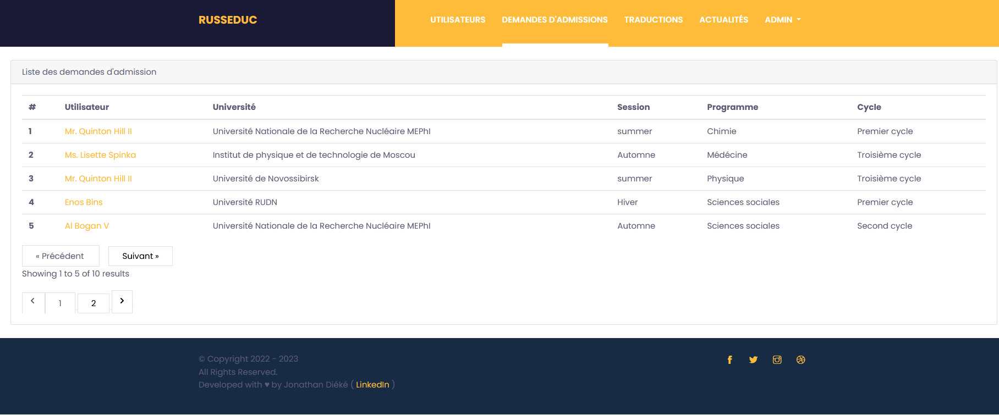

<h1 align="center">RUSSEDUC</h1>

 

 
 

## About RUSSEDUC

RUSSEDUC est une plateforme web construite avec Laravel 9 permettant principalement de collecter des candidatures d'étudiants étrangers pour des universités russes. 

Il est doté d'un espace utilisateur dédié aux candidats où ceux-ci ont la possibilité d'indiquer leurs informations (parcours académiques, diplômes, informations personneles, ...) et entregistrer une candidature. Ils peuvent aussi upload des documents (des diplômes par exemple) en vue d'une traduction :

 

 

Et  d'un système d'administration simple permettant aux admins, entre autres, d'avoir la liste des utilisateurs, collecter les demandes d'admissions, répondre à des demandes de traduction de documents

 

 

 
